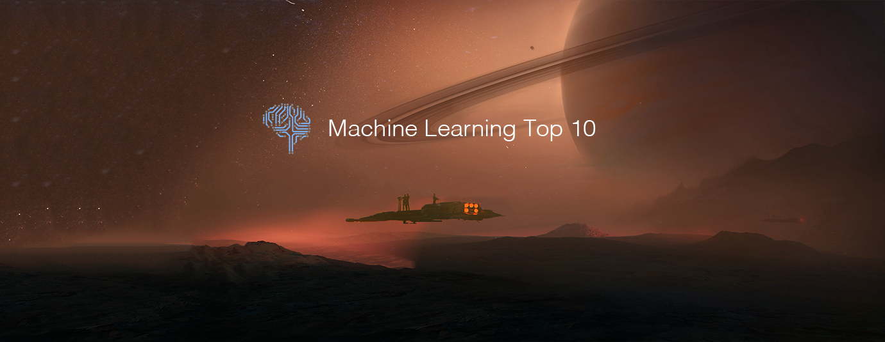

# Machine Learning Top 10 Articles for the Past Month (v.Mar 2018)

</a>

For the past month, we ranked nearly 1,400 Machine Learning articles to pick the Top 10 stories that can help advance your career (0.7% chance).
 
* Topics in this list: Tensor Comprehensions, Deepfakes, Neural Network, Deep reinforcement learning, Audio, DMLab-30, MR images, Lyric Analysis, IRL
* Also published on the [publication](https://medium.mybridge.co/machine-learning-top-10-articles-for-the-past-month-v-mar-2018-a3473d6da21f)

 

#### Course of the month:
[A) Beginners: Machine Learning A-Z™: Hands-On Python & R In Data Science.](http://bit.ly/2oAaMA3) [34,991 recommends, 4.5/5 stars]

[B) Beginners: Data Science, Deep Learning, & Machine Learning with Python.](http://bit.ly/2FbgIcv) [7,610 recommends, 4.5/5 stars]

 

## Rank 1
### [Announcing Tensor Comprehensions](https://research.fb.com/announcing-tensor-comprehensions?utm_source=mybridge&utm_medium=blog&utm_campaign=read_more)

 

## Rank 2
### [Family fun with deepfakes. Or how I got my wife onto the Tonight Show](https://towardsdatascience.com/family-fun-with-deepfakes-or-how-i-got-my-wife-onto-the-tonight-show-a4454775c011?utm_source=mybridge&utm_medium=blog&utm_campaign=read_more)

 

## Rank 3
### [How I Shipped a Neural Network on iOS with CoreML, PyTorch, and React Native - Stefano J. Attardi](https://attardi.org/pytorch-and-coreml?utm_source=mybridge&utm_medium=blog&utm_campaign=read_more)

 

## Rank 4
### [Deep Reinforcement Learning Doesn't Work Yet](https://www.alexirpan.com/2018/02/14/rl-hard.html?utm_source=mybridge&utm_medium=blog&utm_campaign=read_more)

 

## Rank 5
### [How you can train an AI to convert your design mockups into HTML and CSS](https://medium.freecodecamp.org/how-you-can-train-an-ai-to-convert-your-design-mockups-into-html-and-css-cc7afd82fed4?utm_source=mybridge&utm_medium=blog&utm_campaign=read_more)

 

## Rank 6
### [Synthesizing Audio with Generative Adversarial Networks](https://arxiv.org/abs/1802.04208?utm_source=mybridge&utm_medium=blog&utm_campaign=read_more)

 

## Rank 7
### [IMPALA: Scalable Distributed DeepRL in DMLab-30](https://deepmind.com/blog/impala-scalable-distributed-deeprl-dmlab-30?utm_source=mybridge&utm_medium=blog&utm_campaign=read_more)

 

## Rank 8
### [It’s a no-brainer! Deep learning for brain MR images](https://medium.com/stanford-ai-for-healthcare/its-a-no-brainer-deep-learning-for-brain-mr-images-f60116397472?utm_source=mybridge&utm_medium=blog&utm_campaign=read_more)

 

## Rank 9
### [R NLP & Machine Learning: Lyric Analysis ](https://www.datacamp.com/community/tutorials/R-nlp-machine-learning?utm_source=mybridge&utm_medium=blog&utm_campaign=read_more)

 

## Rank 10
### [Inverse Reinforcement Learning pt. I ](https://thinkingwires.com/posts/2018-02-13-irl-tutorial-1.html?utm_source=mybridge&utm_medium=blog&utm_campaign=read_more)
