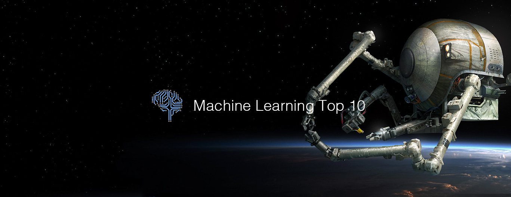

# Machine Learning Top 10 Articles for the Past Month (v.May 2019)

</a>

For the past month, we ranked nearly 1,200 Machine Learning articles to pick the Top 10 stories that can help advance your career (0.8% chance).
 
* Also published on the [publication](https://medium.mybridge.co/machine-learning-top-10-articles-for-the-past-month-v-may-2019-f97115f89bc3)

 

#### Course of the month:

[A) Self Driving Car: Build an Autonomous Car with Python, Deep Learning, and Computer Vision](http://bit.ly/2DYJHye) 7,170 recommends, 4.6/5 stars

[B) Beginner: Machine Learning, Data Science and Deep Learning with Python. TensorFlow & Neural Networks](http://bit.ly/2FbgIcv) 79,663 recommends, 4.6/5 stars

 

 

## Rank 1
### [Generative Modeling with Sparse Transformers](https://openai.com/blog/sparse-transformer?utm_source=mybridge&utm_medium=blog&utm_campaign=read_more)

 

## Rank 2
### [A Recipe for Training Neural Networks](http://karpathy.github.io/2019/04/25/recipe?utm_source=mybridge&utm_medium=blog&utm_campaign=read_more)

 

## Rank 3
### [MuseNet: A deep neural network that can generate 4-minute musical compositions with 10 different instruments, and can combine styles from country to Mozart to the Beatles](https://openai.com/blog/musenet?utm_source=mybridge&utm_medium=blog&utm_campaign=read_more)

 

## Rank 4
### [MorphNet: Towards Faster and Smaller Neural Networks](https://ai.googleblog.com/2019/04/morphnet-towards-faster-and-smaller.html?utm_source=mybridge&utm_medium=blog&utm_campaign=read_more)

 

## Rank 5
### [Advanced NLP with spaCy · A free online course](https://course.spacy.io?utm_source=mybridge&utm_medium=blog&utm_campaign=read_more)

 

## Rank 6
### [Deep Neural Networks Improve Radiologists’ Performance in Breast Cancer Screening](https://medium.com/@jasonphang/deep-neural-networks-improve-radiologists-performance-in-breast-cancer-screening-565eb2bd3c9f?utm_source=mybridge&utm_medium=blog&utm_campaign=read_more)

 

## Rank 7
### [A Visual Exploration of Gaussian Processes](https://distill.pub/2019/visual-exploration-gaussian-processes?utm_source=mybridge&utm_medium=blog&utm_campaign=read_more)

 

## Rank 8
### [Oriol Vinyals: DeepMind AlphaStar, StarCraft, and Language | Artificial Intelligence Podcast](https://www.youtube.com/watch?v=Kedt2or9xlo?utm_source=mybridge&utm_medium=blog&utm_campaign=read_more)

 

## Rank 9
### [Live video streaming over network with OpenCV and ImageZMQ](https://www.pyimagesearch.com/2019/04/15/live-video-streaming-over-network-with-opencv-and-imagezmq?utm_source=mybridge&utm_medium=blog&utm_campaign=read_more)

 

## Rank 10
### [Make Money with Tensorflow 2.0: Make automated investment decisions](https://www.youtube.com/watch?v=WS9Nckd2kq0?utm_source=mybridge&utm_medium=blog&utm_campaign=read_more)
