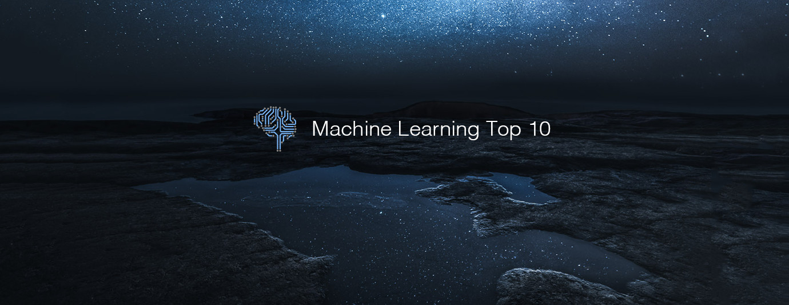

# Machine Learning Top 10 Articles for the Past Month (v.Jun 2018)

</a>

For the past month, we ranked nearly 1,400 Machine Learning articles to pick the Top 10 stories that can help advance your career (0.7% chance).
 
* Topics in this list: Google Duplex, Portraits, Grid cells, Neural Network, Airbnb, Loc2Vec, TensorFlow, Keras, 1st Place Solution, CVPR2018
* Also published on the [publication](https://goo.gl/8F7XQK)

 

#### Course of the month:

[A) Beginners: Python for Data Science and Machine Learning Bootcamp.](http://bit.ly/2Eso3R0) [21,763 recommends, 4.5/5 stars]

[B) Advanced: Artificial Intelligence: Reinforcement Learning in Python.](http://bit.ly/2HzWgyV) [1,768 recommends, 4.6/5 stars]

 

## Rank 1
### [Google Duplex: An AI System for Accomplishing Real World Tasks Over the Phone](https://ai.googleblog.com/2018/05/duplex-ai-system-for-natural-conversation.html?utm_source=mybridge&utm_medium=blog&utm_campaign=read_more)

 

## Rank 2
### [Deep Video Portraits: A novel approach that enables photo-realistic re-animation of portrait videos using only an input video](https://www.youtube.com/watch?v=qc5P2bvfl44&feature=youtu.be&t=7s?utm_source=mybridge&utm_medium=blog&utm_campaign=read_more)

 

## Rank 3
### [Navigating with grid-like representations in artificial agents](https://deepmind.com/blog/grid-cells?utm_source=mybridge&utm_medium=blog&utm_campaign=read_more)

 

## Rank 4
### [How to build your own Neural Network from scratch in Python](https://towardsdatascience.com/how-to-build-your-own-neural-network-from-scratch-in-python-68998a08e4f6?utm_source=mybridge&utm_medium=blog&utm_campaign=read_more)

 

## Rank 5
### [Categorizing Listing Photos at Airbnb: Large-scale deep learning models are changing the way we think about images of homes on our platform.](https://medium.com/airbnb-engineering/categorizing-listing-photos-at-airbnb-f9483f3ab7e3?utm_source=mybridge&utm_medium=blog&utm_campaign=read_more)

 

## Rank 6
### [Loc2Vec: Learning location embeddings with triplet-loss networks](http://www.sentiance.com/2018/05/03/loc2vec-learning-location-embeddings-w-triplet-loss-networks?utm_source=mybridge&utm_medium=blog&utm_campaign=read_more)

 

## Rank 7
### [Real-time Human Pose Estimation in the Browser with TensorFlow.js](https://medium.com/tensorflow/real-time-human-pose-estimation-in-the-browser-with-tensorflow-js-7dd0bc881cd5?utm_source=mybridge&utm_medium=blog&utm_campaign=read_more)

 

## Rank 8
### [Multi-label classification with Keras](https://www.pyimagesearch.com/2018/05/07/multi-label-classification-with-keras?utm_source=mybridge&utm_medium=blog&utm_campaign=read_more)

 

## Rank 9
### [Google Landmark Retrieval Challenge: 1st Place Solution Summary - Kaggle](https://www.kaggle.com/c/landmark-retrieval-challenge/discussion/57855?utm_source=mybridge&utm_medium=blog&utm_campaign=read_more)

 

## Rank 10
### [Learning to See in the Dark](https://arxiv.org/abs/1805.01934?utm_source=mybridge&utm_medium=blog&utm_campaign=read_more)

