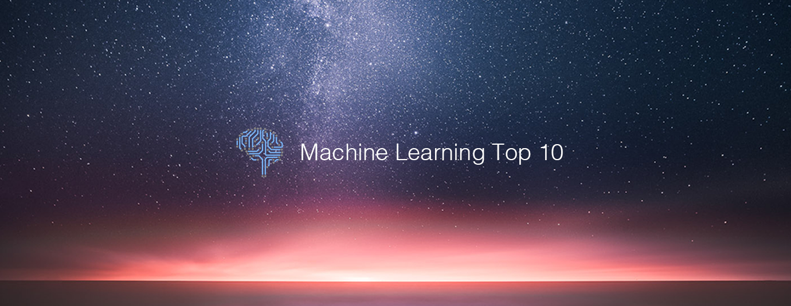

# Machine Learning Top 10 Articles for the Past Month (v.June 2019)

</a>

For the past month, we ranked nearly 1,200 Machine Learning articles to pick the Top 10 stories that can help advance your career (0.8% chance).
 
* Also published on the [publication](https://medium.com/@Mybridge/machine-learning-top-10-articles-for-the-past-month-v-june-2019-be8235cabaf0)

 

#### Course of the month:

[A) Beginner: Machine Learning, Data Science and Deep Learning with Python. TensorFlow & Neural Networks](http://bit.ly/2FbgIcv) [94,132 recommends, 4.5/5 stars]

[B) CNN: Deep Learning with Convolutional Neural Networks in Python](http://bit.ly/2Mbu5gc) [17,357 recommends, 4.6/5 stars]

 
 

## Rank 1
### [Few-Shot Adversarial Learning of Realistic Neural Talking Head Models](https://www.youtube.com/watch?v=p1b5aiTrGzY?utm_source=mybridge&utm_medium=blog&utm_campaign=read_more)

 

## Rank 2
### [Capture the Flag: the emergence of complex cooperative agents](https://deepmind.com/blog/capture-the-flag-science?utm_source=mybridge&utm_medium=blog&utm_campaign=read_more)

 

## Rank 3
### [End-to-End Deep Reinforcement Learning without Reward Engineering](https://bair.berkeley.edu/blog/2019/05/28/end-to-end?utm_source=mybridge&utm_medium=blog&utm_campaign=read_more)

 

## Rank 4
### [Moving Camera, Moving People: A Deep Learning Approach to Depth Prediction](https://ai.googleblog.com/2019/05/moving-camera-moving-people-deep.html?utm_source=mybridge&utm_medium=blog&utm_campaign=read_more)

 

## Rank 5
### [CNNs, Part 1: An Introduction to Convolutional Neural Networks](https://victorzhou.com/blog/intro-to-cnns-part-1?utm_source=mybridge&utm_medium=blog&utm_campaign=read_more)

 

## Rank 6
### [Advancing self-supervision, CV, NLP to keep our platforms safe](https://ai.facebook.com/blog/advances-in-content-understanding-self-supervision-to-protect-people?utm_source=mybridge&utm_medium=blog&utm_campaign=read_more)

 

## Rank 7
### [Machine Learning Zero to Hero (Google I/O'19)](https://www.youtube.com/watch?v=VwVg9jCtqaU?utm_source=mybridge&utm_medium=blog&utm_campaign=read_more)

 

## Rank 8
### [Deconstructing Lottery Tickets: Zeros, Signs, and the Supermask](https://eng.uber.com/deconstructing-lottery-tickets?utm_source=mybridge&utm_medium=blog&utm_campaign=read_more)

 

## Rank 9
### [Build a Hardware-based Face Recognition System for $150 with the Nvidia Jetson Nano and Python](https://medium.com/@ageitgey/build-a-hardware-based-face-recognition-system-for-150-with-the-nvidia-jetson-nano-and-python-a25cb8c891fd?utm_source=mybridge&utm_medium=blog&utm_campaign=read_more)

 

## Rank 10
### [Descending into modular neuroevolution for logic circuits](https://www.declanoller.com/2019/05/24/descending-into-modular-neuroevolution-for-logic-circuits?utm_source=mybridge&utm_medium=blog&utm_campaign=read_more)

                    
