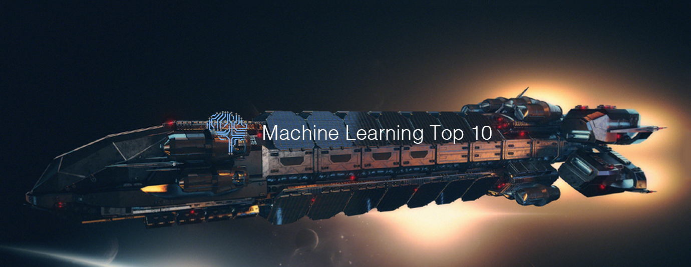

# Machine Learning Top 10 Articles for the Past Month (v.July 2019)

</a>

For the past month, we ranked nearly 1,200 Machine Learning articles to pick the Top 10 stories that can help advance your career (0.8% chance).
 
* Also published on the [publication](https://medium.mybridge.co/machine-learning-top-10-articles-for-the-past-month-v-july-2019-178436f99201)

 

#### Course of the month:

[A) Beginner: Machine Learning, Data Science and Deep Learning with Python. TensorFlow & Neural Networks](http://bit.ly/2FbgIcv) [94,132 recommends, 4.5/5 stars]

[B) CNN: Deep Learning with Convolutional Neural Networks in Python](http://bit.ly/2Mbu5gc) [17,357 recommends, 4.6/5 stars]

 
 

## Rank 1
### [Facebook, Carnegie Mellon build first AI that beats pros in 6-player poker](https://ai.facebook.com/blog/pluribus-first-ai-to-beat-pros-in-6-player-poker?utm_source=mybridge&utm_medium=blog&utm_campaign=read_more)

 

## Rank 2
### [Weight Agnostic Neural Networks](https://weightagnostic.github.io?utm_source=mybridge&utm_medium=blog&utm_campaign=read_more)

 

## Rank 3
### [Neural Point-Based Graphics](https://dmitryulyanov.github.io/neural_point_based_graphics?utm_source=mybridge&utm_medium=blog&utm_campaign=read_more)

 

## Rank 4
### [How evolutionary selection can train more capable self-driving cars | DeepMind](https://deepmind.com/blog/how-evolutionary-selection-can-train-more-capable-self-driving-cars?utm_source=mybridge&utm_medium=blog&utm_campaign=read_more)

 

## Rank 5
### [Introducing Google Research Football: A Novel Reinforcement Learning Environment](https://ai.googleblog.com/2019/06/introducing-google-research-football.html?utm_source=mybridge&utm_medium=blog&utm_campaign=read_more)

 

## Rank 6
### [Building Dab and T-Pose Controlled Lights with Python](https://www.makeartwithpython.com/blog/dab-and-tpose-controlled-lights?utm_source=mybridge&utm_medium=blog&utm_campaign=read_more)

 

## Rank 7
### [Gaining Insights in a Simulated Marketplace with Machine Learning at Uber](https://eng.uber.com/simulated-marketplace?utm_source=mybridge&utm_medium=blog&utm_campaign=read_more)

 

## Rank 8
### [Robustness beyond Security: Computer Vision Applications](http://gradientscience.org/robust_apps?utm_source=mybridge&utm_medium=blog&utm_campaign=read_more)

 

## Rank 9
### [Video classification with Keras and Deep Learning](https://www.pyimagesearch.com/2019/07/15/video-classification-with-keras-and-deep-learning?utm_source=mybridge&utm_medium=blog&utm_campaign=read_more)

 

## Rank 10
### [AI Language Models & Transformers](https://www.youtube.com/watch?v=rURRYI66E54?utm_source=mybridge&utm_medium=blog&utm_campaign=read_more)

                    
