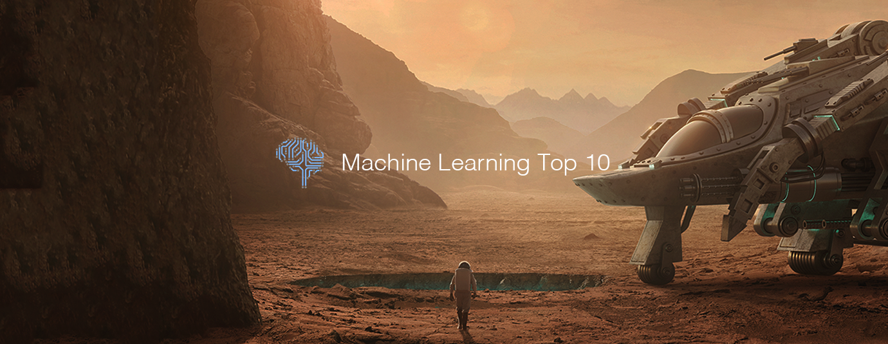

# Machine Learning Top 10 Articles for the Past Month (v.Oct 2018)

</a>

For the past month, we ranked nearly 1,400 Machine Learning articles to pick the Top 10 stories that can help advance your career (0.7% chance).
 
* Topics in this list: Image and Videos, Visual Reinforcement, LSTM’s and GRU’s, CNNs, Deep Learning Computer, TensorFlow 2.0, Uber Eats, Neural machine translation, Doctors, Face Recognition
* Also published on the [publication](https://goo.gl/gLFzdJ)

 

#### Course of the month:

[A) Beginners: Data Science, Deep Learning, & Machine Learning with Python.](http://bit.ly/2FbgIcv) [10,509 recommends, 4.5/5 stars]

[B) Advanced AI: Deep Reinforcement Learning in Python.](http://bit.ly/2DQxHjq) [1,137 recommends, 4.7/5 stars]

 

## Rank 1
### [Rosetta: Understanding text in images and videos with machine learning - Facebook Code](https://code.fb.com/ai-research/rosetta-understanding-text-in-images-and-videos-with-machine-learning?utm_source=mybridge&utm_medium=blog&utm_campaign=read_more)

 

## Rank 2
### [Visual Reinforcement Learning with Imagined Goals](https://bair.berkeley.edu/blog/2018/09/06/rig?utm_source=mybridge&utm_medium=blog&utm_campaign=read_more)

 

## Rank 3
### [Illustrated Guide to LSTM’s and GRU’s: A step by step explanation](https://towardsdatascience.com/illustrated-guide-to-lstms-and-gru-s-a-step-by-step-explanation-44e9eb85bf21?utm_source=mybridge&utm_medium=blog&utm_campaign=read_more)

 

## Rank 4
### [A Look at Image Segmentation using CNNs](https://mohitjain.me/2018/09/30/a-look-at-image-segmentation?utm_source=mybridge&utm_medium=blog&utm_campaign=read_more)

 

## Rank 5
### [Why building your own Deep Learning Computer is 10x cheaper than AWS](https://medium.com/the-mission/why-building-your-own-deep-learning-computer-is-10x-cheaper-than-aws-b1c91b55ce8c?utm_source=mybridge&utm_medium=blog&utm_campaign=read_more)

 

## Rank 6
### [TensorFlow 2.0 Changes](https://www.youtube.com/watch?v=WTNH0tcscqo?utm_source=mybridge&utm_medium=blog&utm_campaign=read_more)

 

## Rank 7
### [Food Discovery with Uber Eats: Recommending for the Marketplace | Uber Engineering Blog](https://eng.uber.com/uber-eats-recommending-marketplace?utm_source=mybridge&utm_medium=blog&utm_campaign=read_more)

 

## Rank 8
### [Scaling neural machine translation to bigger data sets with faster training and inference - Facebook Code](https://code.fb.com/ai-research/scaling-neural-machine-translation-to-bigger-data-sets-with-faster-training-and-inference?utm_source=mybridge&utm_medium=blog&utm_campaign=read_more)

 

## Rank 9
### [A machine learning survival kit for doctors](https://medium.com/owkin/a-machine-learning-survival-kit-for-doctors-97982d69a375?utm_source=mybridge&utm_medium=blog&utm_campaign=read_more)

 

## Rank 10
### [OpenCV Face Recognition](https://www.pyimagesearch.com/2018/09/24/opencv-face-recognition?utm_source=mybridge&utm_medium=blog&utm_campaign=read_more)

                    
