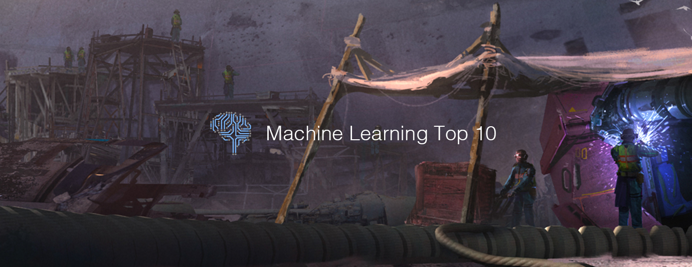

# Machine Learning Top 10 Articles for the Past Month (v.Dec 2018)

</a>

For the past month, we ranked nearly 1,400 Machine Learning articles to pick the Top 10 stories that can help advance your career (0.7% chance).
 
* Also published on the [publication](https://goo.gl/h2JjqM)

 

#### Course of the month:

[A) Beginners: Machine Learning A-Z™: Hands-On Python & R In Data Science.](http://bit.ly/2oAaMA3) [63,713 recommends, 4.5/5 stars]

[B) Machine Learning with Javascript: Master Machine Learning from scratch using Javascript and TensorflowJS with hands-on projects.](http://bit.ly/2rvL7tt) [414 recommends, 4.7/5 stars]

 

## Rank 1
### [AlphaZero: Shedding new light on the grand games of chess, shogi and Go](https://deepmind.com/blog/alphazero-shedding-new-light-grand-games-chess-shogi-and-go?utm_source=mybridge&utm_medium=blog&utm_campaign=read_more)

 

## Rank 2
### [Quantifying Generalization in Reinforcement Learning](https://blog.openai.com/quantifying-generalization-in-reinforcement-learning?utm_source=mybridge&utm_medium=blog&utm_campaign=read_more)

 

## Rank 3
### [The Illustrated BERT, ELMo, and co. (How NLP Cracked Transfer Learning)](http://jalammar.github.io/illustrated-bert?utm_source=mybridge&utm_medium=blog&utm_campaign=read_more)

 

## Rank 4
### [Night Sight: Seeing in the Dark on Pixel Phones](https://ai.googleblog.com/2018/11/night-sight-seeing-in-dark-on-pixel.html?utm_source=mybridge&utm_medium=blog&utm_campaign=read_more)

 

## Rank 5
### [Montezuma’s Revenge Solved by Go-Explore, a New Algorithm for Hard-exploration Problems (Sets Records on Pitfall too)](https://eng.uber.com/go-explore?utm_source=mybridge&utm_medium=blog&utm_campaign=read_more)

 

## Rank 6
### [YOLO object detection with OpenCV](https://www.pyimagesearch.com/2018/11/12/yolo-object-detection-with-opencv?utm_source=mybridge&utm_medium=blog&utm_campaign=read_more)

 

## Rank 7
### [AlphaFold: Using AI for scientific discovery](https://deepmind.com/blog/alphafold?utm_source=mybridge&utm_medium=blog&utm_campaign=read_more)

 

## Rank 8
### [How Face ID Works... Probably - Computerphile](https://www.youtube.com/watch?v=mwTaISbA87A?utm_source=mybridge&utm_medium=blog&utm_campaign=read_more)

 

## Rank 9
### [Learning Concepts with Energy Functions](https://blog.openai.com/learning-concepts-with-energy-functions?utm_source=mybridge&utm_medium=blog&utm_campaign=read_more)

 

## Rank 10
### [Forensic Deep Learning: Kaggle Camera Model Identification Challenge](https://towardsdatascience.com/forensic-deep-learning-kaggle-camera-model-identification-challenge-f6a3892561bd?utm_source=mybridge&utm_medium=blog&utm_campaign=read_more)

                  
